<h1 align="center">
  KISS Fuzzer 💋
</h1>

<p align="center">
  <strong>Keep It Simple, Silly - Handheld JTAG/SWD Fuzzing & Exploitation Tool</strong>
</p>

<p align="center">
  
  
  
  s
  
</p>

---

## Project Overview

KISS Fuzzer is a compact, handheld JTAG/SWD fuzzing and exploitation tool built on the Raspberry Pi Pico W (RP2040). Designed with simplicity and portability in mind, it provides essential hardware debugging and security assessment capabilities in a sleek, Flipper Zero-inspired form factor.

### Key Features

- **Ultra-wide Banner OLED Display** (240×64) for single-line logs and status
- **5-way Joystick Navigation** with tactile button controls
- **Li-ion Battery** with USB-C power-path charging
- **High-Speed JTAG/SWD Interface** up to 10 MHz using PIO
- **Wi-Fi Web Interface** for remote control and log retrieval
- **Optional Power Glitch Injection** via MOSFET
- **MicroSD Card Logging** for scan results and memory dumps
- **Translucent Purple Case** with premium SLA 3D printing

## Documentation

**[Complete Documentation](https://kiss-fuzzer.readthedocs.io/)** - Comprehensive guides, tutorials, and API reference

- **[Getting Started](https://kiss-fuzzer.readthedocs.io/en/latest/getting-started.html)** - First steps and basic usage
- **[Hardware Guide](https://kiss-fuzzer.readthedocs.io/en/latest/hardware.html)** - Technical specifications and pinouts
- **[Tutorials](https://kiss-fuzzer.readthedocs.io/en/latest/tutorials.html)** - Step-by-step examples and techniques
- **[API Reference](https://kiss-fuzzer.readthedocs.io/en/latest/api-reference.html)** - Developer documentation
- **[Troubleshooting](https://kiss-fuzzer.readthedocs.io/en/latest/troubleshooting.html)** - Common issues and solutions

---

## System Architecture

### Hardware Block Diagram


### Software Architecture Flow


### JTAG/SWD Operation Flow


### Task Architecture & Communication


│  │             │  │              │  │                     │ │
│  └─────────────┘  └──────────────┘  └─────────────────────┘ │
├─────────────────────────────────────────────────────────────┤
│                       Pico SDK                              │
└─────────────────────────────────────────────────────────────┘
```

---

## Components & Specifications

### Core Hardware
- **MCU**: Raspberry Pi Pico W (RP2040)
  - Dual-core ARM Cortex-M0+ @ 133MHz
  - 264KB SRAM, 2MB Flash
  - 8 PIO state machines for high-speed protocols
- **Display**: 240×64 OLED (Banner style)
- **Input**: 5-way joystick with center press
- **Power**: 3.7V Li-ion battery with USB-C charging
- **Storage**: MicroSD card slot
- **Connectivity**: Wi-Fi 802.11n (2.4GHz)

### JTAG/SWD Interface
- **Protocols**: JTAG (IEEE 1149.1), SWD (Serial Wire Debug)
- **Speed**: Up to 10 MHz using PIO
- **Pins**: TCK, TDI, TDO, TMS, TRST, RESET
- **Voltage Levels**: 1.8V - 5V (configurable)
- **Protection**: Over-voltage and reverse polarity protection

### Additional Features
- **Power Glitch**: Optional MOSFET-based voltage glitching
- **Target Power**: 3.3V/5V output with current limiting
- **Status LEDs**: Power, Activity, Error indication
- **Case**: Translucent purple SLA 3D printed

---

## Capabilities

### JTAG/SWD Operations
- **Device Scanning**: Automatic JTAG chain detection
- **Pinout Detection**: Smart pin identification
- **Boundary Scan**: IEEE 1149.1 boundary scan testing
- **Memory Operations**: Read/Write/Dump target memory
- **Debug Interface**: Basic debugging capabilities
- **Custom Protocols**: Extensible for proprietary interfaces

### Security Features
- **Fuzzing Engine**: Protocol and data fuzzing
- **Power Glitching**: Fault injection attacks
- **Flash Extraction**: Firmware dumping
- **Bypass Techniques**: Debug protection circumvention
- **Side-channel**: Basic timing and power analysis

### User Interface
- **Local Control**: Joystick navigation with OLED feedback
- **Web Interface**: Mobile-friendly remote control
- **Logging**: Real-time status and comprehensive logging
- **File Management**: SD card file operations via web UI

---

## 🚀 Getting Started

### Prerequisites
- Raspberry Pi Pico SDK
- FreeRTOS Kernel
- CMake 3.13+
- GCC ARM toolchain

### Building the Firmware

```bash
# Clone the repository
git clone https://github.com/your-username/KISS-Fuzzer.git
cd KISS-Fuzzer

# Initialize submodules
git submodule update --init --recursive

# Create build directory
mkdir build && cd build

# Configure and build
cmake ..
make -j4

# Flash to Pico W
cp kiss_fuzzer.uf2 /path/to/pico/mount/
```

### First Boot Setup

1. **Power On**: Connect USB-C cable or insert charged battery
2. **Wi-Fi Setup**: Use joystick to navigate to Wi-Fi settings
3. **Web Access**: Connect to `http://kiss-fuzzer.local` or displayed IP
4. **Target Connection**: Connect JTAG/SWD cables to target device
5. **Start Scanning**: Use local UI or web interface to begin operations

---

## Usage

### Local Interface Navigation


### Web Interface Features
- **Dashboard**: Real-time status and battery level
- **Scan Control**: Start/stop operations remotely
- **Log Viewer**: Live log streaming and filtering
- **File Manager**: Download scan results and dumps
- **Settings**: Wi-Fi, target voltage, scan parameters

### Command Examples

**Basic JTAG Scan:**
```
Navigate: Main Menu → Scan JTAG → Auto Detect
Result: Displays detected devices and IDCODE
```

**Memory Dump:**
```
Navigate: Main Menu → Manual Mode → Memory Ops → Dump
Config: Start Address: 0x08000000, Size: 64KB
Result: Saves firmware.bin to SD card
```

**Power Glitch Attack:**
```
Navigate: Main Menu → Glitch Tool → Voltage Glitch
Config: Delay: 1000µs, Width: 10µs, Repeat: 1000
Result: Attempts to bypass security checks
```

### Usage Workflow Sequence


---

## Pin Configuration & GPIO Mapping

### JTAG/SWD Connector Pinout


### Internal GPIO Mapping


```mermaid
graph LR
    subgraph "RP2040 GPIO Pins"
        subgraph "Display Interface"
            G0[GPIO 0: SPI0 SCK]
            G1[GPIO 1: SPI0 TX]
            G2[GPIO 2: SPI0 RX]
            G3[GPIO 3: SPI0 CS]
        end
        
        subgraph "User Interface"
            G4[GPIO 4: Joy Up]
            G5[GPIO 5: Joy Down]
            G6[GPIO 6: Joy Left]
            G7[GPIO 7: Joy Right]
            G8[GPIO 8: Joy OK]
        end
        
        subgraph "JTAG Interface"
            G10[GPIO 10: TCK]
            G11[GPIO 11: TMS]
            G12[GPIO 12: TDI]
            G13[GPIO 13: TDO]
            G14[GPIO 14: TRST]
            G15[GPIO 15: RESET]
        end
        
        subgraph "Storage Interface"
            G16[GPIO 16: SPI1 SCK]
            G17[GPIO 17: SPI1 TX]
            G18[GPIO 18: SPI1 RX]
            G19[GPIO 19: SPI1 CS]
        end
        
        subgraph "Power & Status"
            G20[GPIO 20: Power Ctrl]
            G21[GPIO 21: Glitch Ctrl]
            G22[GPIO 22: Target VCC]
            G25[GPIO 25: Status LED]
            G26[GPIO 26: Battery ADC]
            G27[GPIO 27: Activity LED]
        end
    end
    
    subgraph "External Connections"
        OLED[240×64 OLED Display]
        JOY[5-Way Joystick]
        JTAG[JTAG/SWD Port]
        SD[MicroSD Card]
        PWR[Power System]
        LED[Status LEDs]
    end
    
    G0 --> OLED
    G1 --> OLED
    G2 --> OLED
    G3 --> OLED
    
    G4 --> JOY
    G5 --> JOY
    G6 --> JOY
    G7 --> JOY
    G8 --> JOY
    
    G10 --> JTAG
    G11 --> JTAG
    G12 --> JTAG
    G13 --> JTAG
    G14 --> JTAG
    G15 --> JTAG
    
    G16 --> SD
    G17 --> SD
    G18 --> SD
    G19 --> SD
    
    G20 --> PWR
    G21 --> PWR
    G22 --> PWR
    G25 --> LED
    G26 --> PWR
    G27 --> LED
```

 8 │ GND    │ Ground
```

### Internal GPIO Mapping
- **Display**: SPI0 (GPIO 0-3)
- **Joystick**: GPIO 4-8 (Up/Down/Left/Right/OK)
- **JTAG**: GPIO 10-15
- **SD Card**: SPI1 (GPIO 16-19)
- **Power Control**: GPIO 20-22
- **Status LEDs**: GPIO 25-27

---

## Development

### Project Structure
```
KISS-Fuzzer/
├── src/                    # Source code
│   ├── main.c             # Main application entry
│   ├── display.c/h        # OLED display driver
│   ├── ui.c/h            # User interface system
│   ├── jtag.c/h          # JTAG/SWD implementation
│   ├── wifi.c/h          # Wi-Fi and web server
│   ├── power.c/h         # Power management
│   ├── storage.c/h       # SD card operations
│   └── jtag.pio          # PIO assembly for JTAG
├── res/                   # Resources
│   └── img/              # Images and graphics
├── hardware/             # PCB design files
├── case/                 # 3D printable case files
├── CMakeLists.txt        # Build configuration
└── README.md            # This file
```

### Development Workflow


### Quality Assurance Process


### Adding New Features

1. **Create Module**: Add new .c/.h files in `src/`
2. **Update CMake**: Add sources to `CMakeLists.txt`
3. **FreeRTOS Task**: Create dedicated task for new functionality
4. **Inter-task Communication**: Use queues/semaphores for data sharing
5. **Documentation**: Add Doxygen comments for all functions

### Coding Standards
- **Language**: C99 with GCC extensions
- **Style**: 4-space indentation, snake_case naming
- **Documentation**: Doxygen-style comments for all public functions
- **Error Handling**: Always check return values and handle errors gracefully
- **Memory Management**: Use FreeRTOS heap, avoid dynamic allocation in ISRs

---

## Hardware Assembly

### PCB Specifications
- **Layers**: 4-layer PCB with controlled impedance
- **Size**: 85mm × 55mm (credit card size)
- **Thickness**: 1.6mm with HASL finish
- **Components**: All surface-mount for compact design

### Case Design
- **Material**: Translucent purple resin (SLA 3D printing)
- **Finish**: Smooth surface with minimal layer lines
- **Features**: Snap-fit assembly, integrated button caps
- **Cutouts**: Precise tolerances for connectors and display

### Assembly Steps
1. **PCB Population**: Solder all SMD components (use stencil for efficiency)
2. **Programming**: Flash bootloader and test firmware
3. **Case Preparation**: Remove support material, test fit
4. **Final Assembly**: Install PCB, battery, and close case
5. **Quality Control**: Test all functions and calibrate display

---

## Technical Deep Dive

### PIO Implementation
The RP2040's Programmable I/O (PIO) enables high-speed, deterministic JTAG/SWD communication:

```asm
; JTAG Clock Generation - 10 MHz
.program jtag_clock
    set pins, 1    ; TCK high
    wait 1 gpio 0  ; Wait for ready signal  
    set pins, 0    ; TCK low
    wait 0 gpio 0  ; Wait for ready signal
```

### Memory Management
FreeRTOS heap configuration optimized for embedded constraints:
- **Heap Size**: 128KB for tasks and buffers
- **Stack Sizes**: UI (2KB), JTAG (4KB), Wi-Fi (8KB)
- **DMA Buffers**: Dedicated regions for high-speed transfers

### Power Optimization
- **Sleep Modes**: Automatic CPU scaling based on activity
- **Wi-Fi Management**: Connection keep-alive with power saving
- **Display**: Automatic timeout and brightness control
- **Battery Life**: 8+ hours typical usage, 48+ hours standby

---

## 🤝 Contributing

We welcome contributions from the hardware hacking and embedded development community!

### How to Contribute
1. **Fork** the repository
2. **Create** a feature branch (`git checkout -b feature/amazing-feature`)
3. **Commit** your changes (`git commit -m 'Add amazing feature'`)
4. **Push** to the branch (`git push origin feature/amazing-feature`)
5. **Open** a Pull Request

### Development Areas
- **Protocol Support**: Additional debug interfaces (SPI, I2C, UART)
- **Fuzzing Algorithms**: Advanced fuzzing strategies
- **Hardware Mods**: Power glitching improvements
- **Web Interface**: Enhanced UI/UX features
- **Documentation**: Tutorials and use cases

---

## Legal & Disclaimer

### Educational Purpose
KISS Fuzzer is designed for:
- **Security Research**: Authorized penetration testing
- **Education**: Learning hardware security concepts  
- **Development**: Debugging embedded systems
- **Compliance**: Security assessment and validation

### Responsible Use
- Only use on systems you own or have explicit permission to test
- Respect local laws and regulations regarding security tools
- Follow responsible disclosure for any vulnerabilities found
- Do not use for malicious purposes or unauthorized access

### License
This project is licensed under the MIT License - see the [LICENSE](LICENSE) file for details.

---

## 📞 Support & Community

### Getting Help
- **Documentation**: Check this README and inline code comments
- **Issues**: Report bugs and request features on GitHub Issues
- **Discussions**: Join the community discussion forum
- **Discord**: Real-time chat with other users and developers

### Links
- **GitHub**: [https://github.com/your-username/KISS-Fuzzer](https://github.com/your-username/KISS-Fuzzer)
- **Documentation**: [https://kiss-fuzzer.readthedocs.io](https://kiss-fuzzer.readthedocs.io)
- **Hardware Files**: Available in the `hardware/` directory
- **3D Models**: STL files in the `case/` directory

---

<p align="center">
  Made with 💜 by the hardware security community<br>
  <em>"Keep It Simple, Silly - but make it powerful"</em>
</p>
