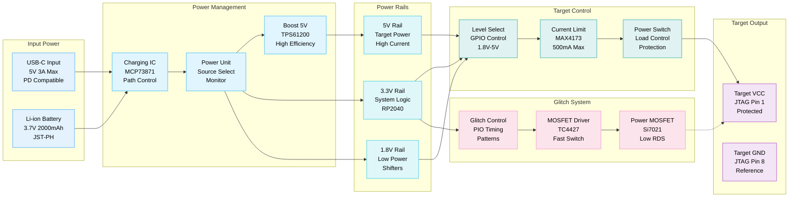
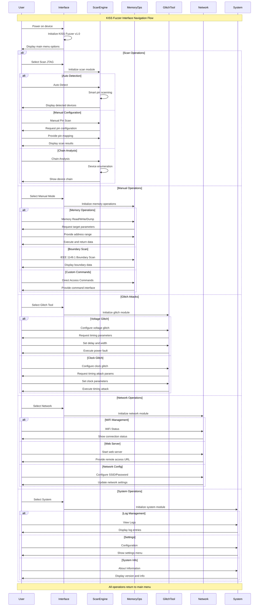

<h1 align="center">
  KISS
</h1>

<p align="center">
  <strong>Keep It Simple, Silly - Handheld JTAG/SWD Fuzzing & Exploitation Tool</strong>
</p>

<p align="center">
  
  
  
  
  
</p>

---

## Project Overview

KISS Fuzzer is a compact, handheld JTAG/SWD fuzzing and exploitation tool built on the Raspberry Pi Pico W (RP2040). Designed with simplicity and portability in mind, it provides essential hardware debugging and security assessment capabilities in a sleek, Flipper Zero-inspired form factor.

### Key Features

- **Advanced JTAG/SWD Protocol Engine** - IEEE 1149.1 compliant with custom extensions, 10MHz operation via PIO
- **Hardware Fault Injection** - Precision voltage/clock glitching with sub-microsecond timing control
- **Intelligent Target Detection** - Automatic pinout discovery and device chain enumeration
- **Remote Operation Capability** - Full-featured web interface with real-time control and monitoring
- **Comprehensive Data Logging** - Structured logging with timestamped scan results and memory dumps
- **Portable Power System** - 8+ hour of planned battery life with USB-C fast charging and power management
- **Multi-Voltage Target Support** - Software-selectable 1.8V/3.3V/5V with current limiting protection

## Documentation & Community

<div align="left">

### Complete Documentation Hub
[](https://kiss-fuzz.readthedocs.io/en/latest/?badge=latest)
[](https://kiss-fuzz.readthedocs.io/)
[](https://kiss-fuzz.readthedocs.io/en/latest/api-reference.html)
[](https://github.com/seedon198/KISS/wiki)

| Resource | Description | Status |
|:---------|:------------|:-------|
| **[Getting Started](https://kiss-fuzz.readthedocs.io/en/latest/getting-started.html)** | Quick setup and first scan | Complete |
| **[Hardware Guide](https://kiss-fuzz.readthedocs.io/en/latest/hardware.html)** | Assembly, pinouts, specifications | Complete |
| **[Tutorials](https://kiss-fuzz.readthedocs.io/en/latest/tutorials.html)** | Step-by-step attack scenarios | Complete |
| **[API Reference](https://kiss-fuzz.readthedocs.io/en/latest/api-reference.html)** | Complete function documentation | Complete |
| **[Troubleshooting](https://kiss-fuzz.readthedocs.io/en/latest/troubleshooting.html)** | Common issues and solutions | Complete |
| **[Development](https://kiss-fuzz.readthedocs.io/en/latest/development.html)** | Contributing and extending | Complete |
| **[Comprehensive Wiki](https://github.com/seedon198/KISS/wiki)** | Community guides, FAQ, multi-language | Complete |

</div>

### Security & Bug Bounty

<div align="left">

| Resource | Description | Rewards |
|:---------|:------------|:--------|
| **[Security Policy](https://github.com/seedon198/KISS/wiki/Security-Policy)** | Our security practices and standards | - |
| **[Bug Bounty Program](https://github.com/seedon198/KISS/wiki/Bug-Bounty-Program)** | Report vulnerabilities for exclusive swag | Premium Swag |
| **[Hall of Fame](https://github.com/seedon198/KISS/wiki/Hall-of-Fame)** | Security researchers who helped us | Recognition |
| **Security Contact** | security@kissfuzzer.dev | PGP Available |

**Vulnerability Rewards:**
- **Critical**: Limited Edition PCB + Premium T-shirt + Sticker Pack + Hall of Fame
- **High**: T-shirt + Sticker Pack + Certificate + Hall of Fame  
- **Medium**: Sticker Pack + Hall of Fame
- **Low**: Hall of Fame Recognition

</div>

### Multi-Language Support

<div style="text-align: justify;">
Our comprehensive documentation system provides multi-language support through automated translation services, ensuring global accessibility for developers and security researchers worldwide. The documentation is automatically built and deployed across multiple language versions, maintaining consistency and up-to-date information across all supported languages.
</div>

| Language | Wiki | Documentation | Status |
|:---------|:-----|:--------------|:-------|
| **English** | [Wiki](https://github.com/seedon198/KISS/wiki) | [Read the Docs](https://kiss-fuzz.readthedocs.io/en/latest/) | Native |
| **Deutsch** | [Wiki](https://github.com/seedon198/KISS/wiki/Home-DE) | [Dokumentation](https://kiss-fuzz.readthedocs.io/de/latest/) | Auto-translated |
| **Français** | [Wiki](https://github.com/seedon198/KISS/wiki/Home-FR) | [Documentation](https://kiss-fuzz.readthedocs.io/fr/latest/) | Auto-translated |
| **Español** | [Wiki](https://github.com/seedon198/KISS/wiki/Home-ES) | [Documentación](https://kiss-fuzz.readthedocs.io/es/latest/) | Auto-translated |
| **日本語** | [Wiki](https://github.com/seedon198/KISS/wiki/Home-JA) | [ドキュメント](https://kiss-fuzz.readthedocs.io/ja/latest/) | Auto-translated |
| **Русский** | [Wiki](https://github.com/seedon198/KISS/wiki/Home-RU) | [Документация](https://kiss-fuzz.readthedocs.io/ru/latest/) | Auto-translated |
| **中文** | [Wiki](https://github.com/seedon198/KISS/wiki/Home-ZH) | [文档](https://kiss-fuzz.readthedocs.io/zh/latest/) | Auto-translated |
| **Bahasa Indonesia** | [Wiki](https://github.com/seedon198/KISS/wiki/Home-ID) | [Dokumentasi](https://kiss-fuzz.readthedocs.io/id/latest/) | Auto-translated |
| **Română** | [Wiki](https://github.com/seedon198/KISS/wiki/Home-RO) | [Documentație](https://kiss-fuzz.readthedocs.io/ro/latest/) | Auto-translated |

> **Note**: Non-English documentation is automatically translated. For technical accuracy, refer to the English version for critical implementations.

---

## System Architecture

### Power Management & Glitch Injection Architecture



### Hardware Block Diagram

```mermaid
flowchart TB
    subgraph "User Interface Layer"
        direction LR
        J1[5-Way Joystick<br/>Joystick Navigation] 
        USB[USB-C Port<br/>USB Power/Data]
        WIFI[Wi-Fi Module<br/>📶 802.11n]
    end
    
    subgraph "Processing Core"
        direction TB
        MCU[RP2040 MCU<br/>🧠 Dual ARM Cortex-M0+<br/>133MHz • 264KB SRAM]
        PIO[PIO Engine<br/>Fast 8 State Machines<br/>High-Speed Protocol I/O]
        GPIO[GPIO Controller<br/>26 Configurable Pins<br/>3.3V Logic Level]
    end
    
    subgraph "Output & Debug"
        direction LR
        OLED[240×64 OLED<br/>Banner Display<br/>Real-time Status]
        JTAG[JTAG/SWD Port<br/>Debug Interface<br/>10MHz Max Speed]
        SD[MicroSD Card<br/>Data Logging<br/>Scan Results]
    end
    
    subgraph "Power Management"
        direction TB
        BATT[Li-ion Battery<br/>🔋 3.7V 2000mAh<br/>USB-C Charging]
        PMGMT[Power Controller<br/>LDO Regulators<br/>Voltage Monitoring]
        TPWR[Target Power<br/>1.8V - 5V Output<br/>Selectable Levels]
    end
    
    subgraph "Protection & Control"
        direction LR
        PROTECT[Protection Circuit<br/>Over-voltage<br/>Reverse Polarity]
        GLITCH[Glitch Generator<br/>MOSFET Switch<br/>Fault Injection]
        LEDS[Status LEDs<br/>Power/Activity<br/>Error Indication]
    end
    
    %% Connections
    J1 --> MCU
    USB --> BATT
    WIFI --> MCU
    
    MCU --> PIO
    MCU --> GPIO
    
    MCU --> OLED
    PIO --> JTAG
    GPIO --> SD
    
    BATT --> PMGMT
    PMGMT --> MCU
    PMGMT --> TPWR
    
    GPIO --> PROTECT
    GPIO --> GLITCH
    GPIO --> LEDS
    
    PROTECT --> JTAG
    GLITCH --> TPWR
    
    %% Styling
    classDef userInterface fill:#e3f2fd,stroke:#1976d2,stroke-width:2px,color:#000
    classDef processing fill:#e8f5e8,stroke:#388e3c,stroke-width:2px,color:#000
    classDef output fill:#fff3e0,stroke:#f57c00,stroke-width:2px,color:#000
    classDef power fill:#fce4ec,stroke:#c2185b,stroke-width:2px,color:#000
    classDef protection fill:#f3e5f5,stroke:#7b1fa2,stroke-width:2px,color:#000
    
    class J1,USB,WIFI userInterface
    class MCU,PIO,GPIO processing
    class OLED,JTAG,SD output
    class BATT,PMGMT,TPWR power
    class PROTECT,GLITCH,LEDS protection
```



### Software Architecture Flow

```mermaid
flowchart TD
    subgraph "Application Layer"
        direction TB
        APP1[UI System<br/>Menu Navigation<br/>User Interaction]
        APP2[Wi-Fi Server<br/>Web Interface<br/>HTTP API]
        APP3[JTAG Engine<br/>Protocol Handler<br/>Command Processing]
        APP4[Logging System<br/>Event Recording<br/>File Management]
    end
    
    subgraph "FreeRTOS Kernel"
        direction LR
        RTOS1[Task Scheduler<br/>Timer Preemptive<br/>Priority-based]
        RTOS2[Memory Manager<br/>Heap Management<br/>Stack Protection]
        RTOS3[IPC System<br/>Queues & Semaphores<br/>Inter-task Comm.]
    end
    
    subgraph "Hardware Abstraction Layer"
        direction TB
        HAL1[Display Driver<br/>SPI Interface<br/>Graphics Rendering]
        HAL2[Storage Driver<br/>💾 SD Card SPI<br/>File System]
        HAL3[Power Monitor<br/>ADC Reading<br/>Battery Status]
        HAL4[JTAG Driver<br/>Fast PIO State Machines<br/>Protocol Timing]
        HAL5[Network Driver<br/>📶 Wi-Fi Stack<br/>TCP/IP Layer]
    end
    
    subgraph "Pico SDK Foundation"
        direction LR
        SDK1[Hardware APIs<br/>GPIO/SPI/PIO<br/>Low-level Control]
        SDK2[System Services<br/>Clocks/Timers<br/>Interrupt Handling]
        SDK3[Boot & Flash<br/>Start System Init<br/>Flash Management]
    end
    
    %% Vertical connections (layered architecture)
    APP1 --> RTOS1
    APP2 --> RTOS1
    APP3 --> RTOS1
    APP4 --> RTOS1
    
    RTOS1 --> HAL1
    RTOS1 --> HAL2
    RTOS1 --> HAL3
    RTOS1 --> HAL4
    RTOS1 --> HAL5
    
    HAL1 --> SDK1
    HAL2 --> SDK1
    HAL3 --> SDK1
    HAL4 --> SDK1
    HAL5 --> SDK1
    
    %% Horizontal connections (inter-component)
    APP1 -.-> RTOS3
    APP2 -.-> RTOS3
    APP3 -.-> RTOS3
    APP4 -.-> RTOS3
    
    RTOS1 -.-> RTOS2
    RTOS2 -.-> RTOS3
    
    SDK1 -.-> SDK2
    SDK2 -.-> SDK3
    
    %% Styling
    classDef application fill:#e3f2fd,stroke:#1976d2,stroke-width:2px,color:#000
    classDef rtos fill:#e8f5e8,stroke:#388e3c,stroke-width:2px,color:#000
    classDef hal fill:#fff3e0,stroke:#f57c00,stroke-width:2px,color:#000
    classDef sdk fill:#fce4ec,stroke:#c2185b,stroke-width:2px,color:#000
    
    class APP1,APP2,APP3,APP4 application
    class RTOS1,RTOS2,RTOS3 rtos
    class HAL1,HAL2,HAL3,HAL4,HAL5 hal
    class SDK1,SDK2,SDK3 sdk
```



### JTAG/SWD Operation Flow

```mermaid
flowchart TD
    Start([Start Power On<br/>System Boot]) --> Init[Config Initialize Hardware<br/>GPIO • SPI • PIO • Wi-Fi]
    Init --> SelfTest[Setup Self Test<br/>Display • SD Card • Battery]
    SelfTest --> Menu{Home Main Menu<br/>Select Operation}
    
    Menu -->|1| AutoScan[Search Auto JTAG Scan<br/>Smart Detection]
    Menu -->|2| Manual[Tools Manual Mode<br/>Expert Operations]
    Menu -->|3| Glitch[Fast Power Glitch<br/>Fault Injection]
    Menu -->|4| Network[Network Network Operations<br/>Wi-Fi & Web UI]
    Menu -->|5| Settings[Config Configuration<br/>System Settings]
    
    %% Auto Scan Flow
    AutoScan --> CheckTarget[Check Target<br/>Power & Connectivity]
    CheckTarget --> PinDetect[Detect JTAG Pins<br/>TCK • TMS • TDI • TDO]
    PinDetect --> ValidateChain[Validate Chain<br/>TAP Response Test]
    ValidateChain --> ScanDevices[Scan JTAG Chain<br/>Read Device IDCODEs]
    ScanDevices --> ChainAnalysis[🔬 Chain Analysis<br/>Device Count & Types]
    ChainAnalysis --> DisplayResults[Show Results<br/>OLED Display]
    
    %% Manual Mode Flow
    Manual --> SelectOp{Control Select Operation<br/>Choose Command Type}
    SelectOp -->|📖| MemDump[💾 Memory Dump<br/>Read Flash/RAM]
    SelectOp -->|Search| BoundaryScan[Test Boundary Scan<br/>IEEE 1149.1 Test]
    SelectOp -->|Input| CustomCmd[Tools Custom Commands<br/>Direct JTAG Access]
    SelectOp -->|Sync| MemWrite[Write Memory Write<br/>Program Flash]
    
    %% Glitch Attack Flow
    Glitch --> GlitchSetup[Config Setup Parameters<br/>Timing • Voltage • Count]
    GlitchSetup --> GlitchArm[Target Arm Trigger<br/>Wait for Target State]
    GlitchArm --> GlitchFire[Fast Execute Glitch<br/>MOSFET Pulse]
    GlitchFire --> GlitchAnalyze[Analysis Analyze Response<br/>Success Detection]
    GlitchAnalyze --> GlitchRepeat{Sync Repeat Attack?<br/>Continue Campaign}
    GlitchRepeat -->|Yes| GlitchArm
    GlitchRepeat -->|No| DisplayResults
    
    %% Network Operations
    Network --> WebStart[Network Start Web Server<br/>HTTP on Port 80]
    WebStart --> WebInterface[Mobile Web Interface<br/>Remote Control]
    WebInterface --> WebLogs[Docs Live Logs<br/>Real-time Status]
    
    %% Common Flow
    DisplayResults --> LogSD[💾 Save to SD Card<br/>Timestamped Results]
    MemDump --> LogSD
    BoundaryScan --> LogSD
    CustomCmd --> LogSD
    MemWrite --> LogSD
    GlitchAnalyze --> LogSD
    WebLogs --> LogSD
    
    LogSD --> WebUpdate[Network Update Web Interface<br/>Refresh Dashboard]
    WebUpdate --> BattCheck[🔋 Battery Check<br/>Power Management]
    BattCheck --> BackToMenu{Home Return to Menu?<br/>Continue Operation}
    BackToMenu -->|Yes| Menu
    BackToMenu -->|No| Shutdown[Stop System Shutdown<br/>Safe Power Down]
    
    Settings --> ConfigNetwork[📶 Wi-Fi Settings<br/>SSID • Password]
    Settings --> ConfigTarget[Target Target Config<br/>Voltage • Speed]
    Settings --> ConfigSystem[Config System Config<br/>Display • Logging]
    ConfigNetwork --> Menu
    ConfigTarget --> Menu
    ConfigSystem --> Menu
    
    %% Error Handling
    PinDetect -->|Failed Failed| ErrorHandler[Failed Error Handler<br/>Display Issue]
    ValidateChain -->|Failed Failed| ErrorHandler
    ScanDevices -->|Failed Failed| ErrorHandler
    ErrorHandler --> Menu
    
    %% Styling
    classDef startEnd fill:#c8e6c9,stroke:#81c784,stroke-width:2px,color:#000
    classDef menu fill:#bbdefb,stroke:#90caf9,stroke-width:2px,color:#000
    classDef operation fill:#ffe0b2,stroke:#ffcc02,stroke-width:2px,color:#000
    classDef storage fill:#e1bee7,stroke:#ce93d8,stroke-width:2px,color:#000
    classDef network fill:#b2ebf2,stroke:#80deea,stroke-width:2px,color:#000
    classDef error fill:#ffcdd2,stroke:#f8bbd9,stroke-width:2px,color:#000
    classDef glitch fill:#f8bbd9,stroke:#f48fb1,stroke-width:2px,color:#000
    
    class Start,Shutdown startEnd
    class Menu,BackToMenu menu
    class AutoScan,Manual,PinDetect,ScanDevices,MemDump,BoundaryScan,CustomCmd,MemWrite operation
    class LogSD,WebUpdate,DisplayResults storage
    class Network,WebStart,WebInterface,WebLogs,ConfigNetwork network
    class ErrorHandler error
    class Glitch,GlitchSetup,GlitchArm,GlitchFire,GlitchAnalyze,GlitchRepeat glitch
```



### Task Architecture & Communication


---

## Components & Specifications

### Core Hardware
- **MCU**: Raspberry Pi Pico W (RP2040)
  - Dual-core ARM Cortex-M0+ @ 133MHz
  - 264KB SRAM, 2MB Flash
  - 8 PIO state machines for high-speed protocols
- **Display**: 240×64 OLED (Banner style)
- **Input**: 5-way joystick with center press
- **Power**: 3.7V Li-ion battery with USB-C charging
- **Storage**: MicroSD card slot
- **Connectivity**: Wi-Fi 802.11n (2.4GHz)

### JTAG/SWD Interface
- **Protocols**: JTAG (IEEE 1149.1), SWD (Serial Wire Debug)
- **Speed**: Up to 10 MHz using PIO
- **Pins**: TCK, TDI, TDO, TMS, TRST, RESET
- **Voltage Levels**: 1.8V - 5V (configurable)
- **Protection**: Over-voltage and reverse polarity protection

### Additional Features
- **Power Glitch**: Optional MOSFET-based voltage glitching
- **Target Power**: 3.3V/5V output with current limiting
- **Status LEDs**: Power, Activity, Error indication
- **Case**: Translucent purple SLA 3D printed

---

## Capabilities

### JTAG/SWD Operations
- **Device Scanning**: Automatic JTAG chain detection
- **Pinout Detection**: Smart pin identification
- **Boundary Scan**: IEEE 1149.1 boundary scan testing
- **Memory Operations**: Read/Write/Dump target memory
- **Debug Interface**: Basic debugging capabilities
- **Custom Protocols**: Extensible for proprietary interfaces

### Security Features
- **Fuzzing Engine**: Protocol and data fuzzing
- **Power Glitching**: Fault injection attacks
- **Flash Extraction**: Firmware dumping
- **Bypass Techniques**: Debug protection circumvention
- **Side-channel**: Basic timing and power analysis

### User Interface
- **Local Control**: Joystick navigation with OLED feedback
- **Web Interface**: Mobile-friendly remote control
- **Logging**: Real-time status and comprehensive logging
- **File Management**: SD card file operations via web UI

---

## Start Getting Started

### Prerequisites
- Raspberry Pi Pico SDK
- FreeRTOS Kernel
- CMake 3.13+
- GCC ARM toolchain

### Building the Firmware

```bash
# Clone the repository
git clone https://github.com/your-username/KISS.git
cd KISS

# Initialize submodules
git submodule update --init --recursive

# Create build directory
mkdir build && cd build

# Configure and build
cmake ..
make -j4

# Flash to Pico W
cp kiss_fuzzer.uf2 /path/to/pico/mount/
```

### First Boot Setup

1. **Power On**: Connect USB-C cable or insert charged battery
2. **Wi-Fi Setup**: Use joystick to navigate to Wi-Fi settings
3. **Web Access**: Connect to `http://kiss-fuzzer.local` or displayed IP
4. **Target Connection**: Connect JTAG/SWD cables to target device
5. **Start Scanning**: Use local UI or web interface to begin operations

---

## Usage

### Local Interface Navigation



### Web Interface Features
- **Dashboard**: Real-time status and battery level
- **Scan Control**: Start/stop operations remotely
- **Log Viewer**: Live log streaming and filtering
- **File Manager**: Download scan results and dumps
- **Settings**: Wi-Fi, target voltage, scan parameters

### Command Examples

**Basic JTAG Scan:**
```
Navigate: Main Menu → Scan JTAG → Auto Detect
Result: Displays detected devices and IDCODE
```

**Memory Dump:**
```
Navigate: Main Menu → Manual Mode → Memory Ops → Dump
Config: Start Address: 0x08000000, Size: 64KB
Result: Saves firmware.bin to SD card
```

**Power Glitch Attack:**
```
Navigate: Main Menu → Glitch Tool → Voltage Glitch
Config: Delay: 1000µs, Width: 10µs, Repeat: 1000
Result: Attempts to bypass security checks
```

### Usage Workflow Sequence


---

## Pin Configuration & GPIO Mapping

### JTAG/SWD Connector Pinout

```mermaid
flowchart LR
    subgraph "JTAG/SWD 8-Pin Connector"
        direction TB
        
        subgraph "Top Row (1-4)"
            P1[🔴 Pin 1: VCC<br/>Target Power Supply<br/>1.8V / 3.3V / 5.0V<br/>Max: 500mA]
            P2[🔵 Pin 2: TCK/SWCLK<br/>Test Clock<br/>SWD Clock<br/>Max: 10MHz]
            P3[🟢 Pin 3: TDI<br/>Test Data Input<br/>JTAG Only<br/>3.3V Logic]
            P4[🟡 Pin 4: TDO/SWO<br/>Test Data Output<br/>SWD Trace Output<br/>3.3V Logic]
        end
        
        subgraph "Bottom Row (5-8)"
            P5[🟠 Pin 5: TMS/SWDIO<br/>Test Mode Select<br/>SWD Data I/O<br/>Bidirectional]
            P6[🟣 Pin 6: TRST<br/>Test Reset<br/>Optional Signal<br/>Active Low]
            P7[⚫ Pin 7: NRST<br/>System Reset<br/>Target Reset<br/>Open Drain]
            P8[⚪ Pin 8: GND<br/>Ground Reference<br/>Common Ground<br/>Shield Connection]
        end
    end
    
    subgraph "Signal Types"
        direction TB
        PWR[🔴 Power Signals<br/>• VCC: Configurable voltage<br/>• GND: Reference ground]
        CLK[🔵 Clock Signals<br/>• TCK: JTAG test clock<br/>• SWCLK: SWD clock]
        DATA[🟢🟡🟠 Data Signals<br/>• TDI/TDO: JTAG data<br/>• TMS/SWDIO: Mode/Data<br/>• SWO: Trace output]
        CTL[🟣⚫ Control Signals<br/>• TRST: Test reset<br/>• NRST: System reset]
    end
    
    subgraph "Protocol Support"
        direction LR
        JTAG_MODE[Search JTAG Mode<br/>IEEE 1149.1<br/>Uses: TCK, TMS, TDI, TDO<br/>Optional: TRST]
        SWD_MODE[Fast SWD Mode<br/>ARM Serial Wire Debug<br/>Uses: SWCLK, SWDIO<br/>Optional: SWO, NRST]
    end
    
    %% Pin to signal type mapping
    P1 --> PWR
    P8 --> PWR
    P2 --> CLK
    P3 --> DATA
    P4 --> DATA
    P5 --> DATA
    P6 --> CTL
    P7 --> CTL
    
    %% Protocol usage
    JTAG_MODE -.-> P2
    JTAG_MODE -.-> P3
    JTAG_MODE -.-> P4
    JTAG_MODE -.-> P5
    JTAG_MODE -.-> P6
    
    SWD_MODE -.-> P2
    SWD_MODE -.-> P4
    SWD_MODE -.-> P5
    SWD_MODE -.-> P7
    
    %% Styling
    classDef power fill:#ffcdd2,stroke:#d32f2f,stroke-width:2px,color:#000
    classDef clock fill:#c8e6c9,stroke:#388e3c,stroke-width:2px,color:#000
    classDef data fill:#fff9c4,stroke:#f57f17,stroke-width:2px,color:#000
    classDef control fill:#e1bee7,stroke:#7b1fa2,stroke-width:2px,color:#000
    classDef ground fill:#f5f5f5,stroke:#424242,stroke-width:2px,color:#000
    classDef protocol fill:#e3f2fd,stroke:#1976d2,stroke-width:2px,color:#000
    
    class P1 power
    class P2 clock
    class P3,P4,P5 data
    class P6,P7 control
    class P8 ground
    class JTAG_MODE,SWD_MODE protocol
```



### Internal GPIO Mapping


```mermaid
flowchart TD
    subgraph "RP2040 GPIO Allocation"
        direction TB
        
        subgraph "Display Interface (SPI0)"
            direction TB
            G0[📺 GPIO 0<br/>SPI0 SCK<br/>OLED Clock]
            G1[📺 GPIO 1<br/>SPI0 TX<br/>OLED Data]
            G2[📺 GPIO 2<br/>SPI0 RX<br/>OLED Unused]
            G3[📺 GPIO 3<br/>SPI0 CS<br/>OLED Select]
            G9[📺 GPIO 9<br/>DC Control<br/>Data/Command]
            
            G0 --- G1
            G1 --- G2
            G2 --- G3
            G3 --- G9
        end
        
        subgraph "User Interface Controls"
            direction TB
            G4[Joystick GPIO 4<br/>Joystick Up<br/>Pull-up Input]
            G5[Joystick GPIO 5<br/>Joystick Down<br/>Pull-up Input]
            G6[Joystick GPIO 6<br/>Joystick Left<br/>Pull-up Input]
            G7[Joystick GPIO 7<br/>Joystick Right<br/>Pull-up Input]
            G8[Joystick GPIO 8<br/>Joystick OK<br/>Pull-up Input]
            
            G4 --- G5
            G5 --- G6
            G6 --- G7
            G7 --- G8
        end
        
        subgraph "JTAG/SWD Interface"
            direction TB
            G10[Search GPIO 10<br/>TCK/SWCLK<br/>Test Clock]
            G11[Search GPIO 11<br/>TMS/SWDIO<br/>Mode Select/Data]
            G12[Search GPIO 12<br/>TDI<br/>Test Data In]
            G13[Search GPIO 13<br/>TDO/SWO<br/>Test Data Out]
            G14[Search GPIO 14<br/>TRST<br/>Test Reset]
            G15[Search GPIO 15<br/>NRST<br/>System Reset]
            
            G10 --- G11
            G11 --- G12
            G12 --- G13
            G13 --- G14
            G14 --- G15
        end
        
        subgraph "Storage Interface (SPI1)"
            direction TB
            G16[💾 GPIO 16<br/>SPI1 SCK<br/>SD Clock]
            G17[💾 GPIO 17<br/>SPI1 TX<br/>SD Data Out]
            G18[💾 GPIO 18<br/>SPI1 RX<br/>SD Data In]
            G19[💾 GPIO 19<br/>SPI1 CS<br/>SD Select]
            
            G16 --- G17
            G17 --- G18
            G18 --- G19
        end
        
        subgraph "Power & Control Systems"
            direction TB
            G20[Fast GPIO 20<br/>Target Power<br/>Enable Control]
            G21[Fast GPIO 21<br/>Glitch Control<br/>MOSFET Gate]
            G22[Fast GPIO 22<br/>Voltage Select<br/>Level Shifter]
            G23[Fast GPIO 23<br/>Current Sense<br/>Protection Monitor]
            
            G20 --- G21
            G21 --- G22
            G22 --- G23
        end
        
        subgraph "Status & Monitoring"
            direction TB
            G24[Info GPIO 24<br/>Error LED<br/>Red Status]
            G25[Info GPIO 25<br/>Activity LED<br/>Built-in LED]
            G26[🔋 GPIO 26<br/>Battery ADC<br/>Voltage Monitor]
            G27[Info GPIO 27<br/>Status LED<br/>Green Status]
            G28[🔋 GPIO 28<br/>Charge Detect<br/>USB Power]
            
            G24 --- G25
            G25 --- G26
            G26 --- G27
            G27 --- G28
        end
    end
    
    subgraph "External Hardware Connections"
        direction TB
        
        subgraph "User Interface Hardware"
            OLED[📺 240×64 OLED Display<br/>SSD1322 Controller<br/>SPI Interface]
            JOYSTICK[Joystick 5-Way Joystick<br/>Tactile Switches<br/>Center + 4 Directions]
        end
        
        subgraph "Debug & Test Hardware"
            JTAG_CONN[Search JTAG/SWD Connector<br/>8-pin Debug Header<br/>2.54mm Pitch]
            LEVEL_SHIFT[Fast Level Shifters<br/>1.8V - 5V Support<br/>Bidirectional]
        end
        
        subgraph "Storage & Connectivity"
            SD_CARD[💾 MicroSD Card Slot<br/>Push-push Socket<br/>SPI Mode]
            WIFI_MOD[📶 Wi-Fi Module<br/>Built-in RP2040W<br/>802.11n 2.4GHz]
        end
        
        subgraph "Power Management"
            BATTERY[🔋 Li-ion Battery<br/>3.7V 2000mAh<br/>JST Connector]
            CHARGE_IC[USB Charging IC<br/>USB-C PD Controller<br/>MCP73871]
            POWER_MGMT[Fast Power Management<br/>LDO Regulators<br/>Protection Circuit]
            GLITCH_HW[Fast Glitch Hardware<br/>MOSFET Switch<br/>Precision Timing]
        end
        
        subgraph "Status Indication"
            LED_STATUS[Info Status LEDs<br/>RGB Indicators<br/>System Status]
            LED_ACTIVITY[Info Activity LED<br/>Operation Indicator<br/>Built-in RP2040]
        end
    end
    
    %% GPIO to Hardware Connections
    G0 --> OLED
    G1 --> OLED
    G2 --> OLED
    G3 --> OLED
    G9 --> OLED
    
    G4 --> JOYSTICK
    G5 --> JOYSTICK
    G6 --> JOYSTICK
    G7 --> JOYSTICK
    G8 --> JOYSTICK
    
    G10 --> JTAG_CONN
    G11 --> JTAG_CONN
    G12 --> JTAG_CONN
    G13 --> JTAG_CONN
    G14 --> JTAG_CONN
    G15 --> JTAG_CONN
    
    G16 --> SD_CARD
    G17 --> SD_CARD
    G18 --> SD_CARD
    G19 --> SD_CARD
    
    G20 --> POWER_MGMT
    G21 --> GLITCH_HW
    G22 --> LEVEL_SHIFT
    G23 --> POWER_MGMT
    
    G24 --> LED_STATUS
    G25 --> LED_ACTIVITY
    G26 --> BATTERY
    G27 --> LED_STATUS
    G28 --> CHARGE_IC
    
    %% Hardware interconnections
    JTAG_CONN --> LEVEL_SHIFT
    LEVEL_SHIFT -.-> POWER_MGMT
    BATTERY --> CHARGE_IC
    CHARGE_IC --> POWER_MGMT
    POWER_MGMT -.-> GLITCH_HW
    
    %% Styling
    classDef gpio fill:#e3f2fd,stroke:#1976d2,stroke-width:1px,color:#000
    classDef display fill:#e8f5e8,stroke:#388e3c,stroke-width:2px,color:#000
    classDef ui fill:#fff3e0,stroke:#f57c00,stroke-width:2px,color:#000
    classDef debug fill:#fce4ec,stroke:#c2185b,stroke-width:2px,color:#000
    classDef storage fill:#f3e5f5,stroke:#7b1fa2,stroke-width:2px,color:#000
    classDef power fill:#ffebee,stroke:#d32f2f,stroke-width:2px,color:#000
    classDef status fill:#e0f2f1,stroke:#00695c,stroke-width:2px,color:#000
    
    class G0,G1,G2,G3,G4,G5,G6,G7,G8,G9,G10,G11,G12,G13,G14,G15,G16,G17,G18,G19,G20,G21,G22,G23,G24,G25,G26,G27,G28 gpio
    class OLED display
    class JOYSTICK ui
    class JTAG_CONN,LEVEL_SHIFT debug
    class SD_CARD,WIFI_MOD storage
    class BATTERY,CHARGE_IC,POWER_MGMT,GLITCH_HW power
    class LED_STATUS,LED_ACTIVITY status
```

 8 │ GND    │ Ground
```

### Internal GPIO Mapping
- **Display**: SPI0 (GPIO 0-3)
- **Joystick**: GPIO 4-8 (Up/Down/Left/Right/OK)
- **JTAG**: GPIO 10-15
- **SD Card**: SPI1 (GPIO 16-19)
- **Power Control**: GPIO 20-22
- **Status LEDs**: GPIO 25-27

---

## Development

### Project Structure
```
KISS/
├── src/                    # Source code
│   ├── main.c             # Main application entry
│   ├── display.c/h        # OLED display driver
│   ├── ui.c/h            # User interface system
│   ├── jtag.c/h          # JTAG/SWD implementation
│   ├── wifi.c/h          # Wi-Fi and web server
│   ├── power.c/h         # Power management
│   ├── storage.c/h       # SD card operations
│   └── jtag.pio          # PIO assembly for JTAG
├── res/                   # Resources
│   └── img/              # Images and graphics
├── hardware/             # PCB design files
├── case/                 # 3D printable case files
├── CMakeLists.txt        # Build configuration
└── README.md            # This file
```

### Development Workflow


### Quality Assurance Process

```mermaid
flowchart LR
    subgraph "Pre-Commit Validation"
        direction TB
        PC1[Design clang-format<br/>Code Formatting<br/>Consistent Style]
        PC2[Search cppcheck<br/>Static Analysis<br/>Bug Detection]
        PC3[Fast clang-tidy<br/>Linting & Modernization<br/>Best Practices]
        PC4[Test Unit Tests<br/>Automated Testing<br/>Code Coverage]
        PC5[🔒 Security Scan<br/>Credential Detection<br/>Vulnerability Check]
        
        PC1 --> PC2
        PC2 --> PC3
        PC3 --> PC4
        PC4 --> PC5
    end
    
    subgraph "Continuous Integration Pipeline"
        direction TB
        CI1[🔨 Multi-Platform Build<br/>• macOS (ARM64)<br/>• Linux (x86_64)<br/>• Windows (MSVC)]
        CI2[Test Automated Test Suite<br/>• Unit Tests<br/>• Integration Tests<br/>• Hardware Mocks]
        CI3[Analysis Static Analysis<br/>• Code Quality Metrics<br/>• Complexity Analysis<br/>• Maintainability Index]
        CI4[Package Artifact Generation<br/>• Firmware Binary (.uf2)<br/>• Documentation (HTML)<br/>• Release Package]
        CI5[Security Security Validation<br/>• Dependency Scanning<br/>• SAST Analysis<br/>• License Compliance]
        
        CI1 --> CI2
        CI2 --> CI3
        CI3 --> CI4
        CI4 --> CI5
    end
    
    subgraph "Manual Testing & Validation"
        direction TB
        MT1[Setup Hardware-in-Loop Tests<br/>• Real Pico W Testing<br/>• JTAG Target Validation<br/>• Power System Verification]
        MT2[Fast Performance Testing<br/>• JTAG Speed Benchmarks<br/>• Memory Usage Analysis<br/>• Battery Life Testing]
        MT3[🔒 Security Assessment<br/>• Penetration Testing<br/>• Vulnerability Assessment<br/>• Compliance Validation]
        MT4[👥 User Acceptance Testing<br/>• UI/UX Validation<br/>• Documentation Review<br/>• Field Testing]
        MT5[Network Compatibility Testing<br/>• Target Device Matrix<br/>• Protocol Compliance<br/>• Interoperability]
        
        MT1 --> MT2
        MT2 --> MT3
        MT3 --> MT4
        MT4 --> MT5
    end
    
    subgraph "Quality Gates & Metrics"
        direction TB
        QG1[Stats Code Coverage<br/>Minimum: 80%<br/>Target: 90%+]
        QG2[Target Performance Goals<br/>• Boot Time: <3s<br/>• JTAG Speed: 10MHz<br/>• Battery: 8+ hours]
        QG3[🐛 Bug Density<br/>Maximum: 1 bug/KLOC<br/>Critical: 0 bugs]
        QG4[📚 Documentation<br/>• API Coverage: 100%<br/>• User Guide: Complete<br/>• Examples: Working]
        QG5[🔒 Security Score<br/>• No High/Critical CVEs<br/>• Secrets Scanning: Pass<br/>• Static Analysis: Pass]
        
        QG1 --> QG2
        QG2 --> QG3
        QG3 --> QG4
        QG4 --> QG5
    end
    
    subgraph "Release Readiness Checklist"
        direction TB
        RC1[Success All Tests Pass<br/>• Unit Tests: 100%<br/>• Integration: 100%<br/>• Hardware: Validated]
        RC2[Success Quality Metrics Met<br/>• Coverage Goals<br/>• Performance Targets<br/>• Security Standards]
        RC3[Success Documentation Complete<br/>• User Guides Updated<br/>• API Reference Current<br/>• Change Log Prepared]
        RC4[Success Security Validated<br/>• No Known Vulnerabilities<br/>• Penetration Test Pass<br/>• Compliance Verified]
        RC5[Success Stakeholder Approval<br/>• Code Review Complete<br/>• Product Owner Sign-off<br/>• Legal Clearance]
        
        RC1 --> RC2
        RC2 --> RC3
        RC3 --> RC4
        RC4 --> RC5
    end
    
    %% Flow connections
    PC5 --> CI1
    CI5 --> MT1
    MT5 --> QG1
    QG5 --> RC1
    RC5 --> RELEASE[Start Release Ready<br/>Deploy to Production]
    
    %% Failure paths
    PC1 -.->|Failed Fails| FIX1[Setup Fix Formatting<br/>Auto-format Code]
    PC2 -.->|Failed Fails| FIX2[Setup Fix Static Issues<br/>Address Warnings]
    PC3 -.->|Failed Fails| FIX3[Setup Fix Linting Issues<br/>Modern C++ Practices]
    PC4 -.->|Failed Fails| FIX4[Setup Fix Test Failures<br/>Debug & Update Tests]
    
    CI1 -.->|Failed Fails| FIX5[Setup Fix Build Issues<br/>Platform Compatibility]
    CI2 -.->|Failed Fails| FIX6[Setup Fix Test Issues<br/>Environment Setup]
    CI3 -.->|Failed Fails| FIX7[Setup Fix Quality Issues<br/>Code Refactoring]
    
    MT1 -.->|Failed Fails| FIX8[Setup Fix Hardware Issues<br/>Hardware Debugging]
    MT3 -.->|Failed Fails| FIX9[Setup Fix Security Issues<br/>Vulnerability Remediation]
    
    FIX1 --> PC1
    FIX2 --> PC2
    FIX3 --> PC3
    FIX4 --> PC4
    FIX5 --> CI1
    FIX6 --> CI2
    FIX7 --> CI3
    FIX8 --> MT1
    FIX9 --> MT3
    
    %% Styling
    classDef precommit fill:#e3f2fd,stroke:#1976d2,stroke-width:2px,color:#000
    classDef ci fill:#e8f5e8,stroke:#388e3c,stroke-width:2px,color:#000
    classDef manual fill:#fff3e0,stroke:#f57c00,stroke-width:2px,color:#000
    classDef quality fill:#fce4ec,stroke:#c2185b,stroke-width:2px,color:#000
    classDef release fill:#f3e5f5,stroke:#7b1fa2,stroke-width:2px,color:#000
    classDef fix fill:#ffebee,stroke:#d32f2f,stroke-width:1px,color:#000
    classDef ready fill:#4caf50,stroke:#2e7d32,stroke-width:3px,color:#fff
    
    class PC1,PC2,PC3,PC4,PC5 precommit
    class CI1,CI2,CI3,CI4,CI5 ci
    class MT1,MT2,MT3,MT4,MT5 manual
    class QG1,QG2,QG3,QG4,QG5 quality
    class RC1,RC2,RC3,RC4,RC5 release
    class FIX1,FIX2,FIX3,FIX4,FIX5,FIX6,FIX7,FIX8,FIX9 fix
    class RELEASE ready
```

### Adding New Features

1. **Create Module**: Add new .c/.h files in `src/`
2. **Update CMake**: Add sources to `CMakeLists.txt`
3. **FreeRTOS Task**: Create dedicated task for new functionality
4. **Inter-task Communication**: Use queues/semaphores for data sharing
5. **Documentation**: Add Doxygen comments for all functions

### Coding Standards
- **Language**: C99 with GCC extensions
- **Style**: 4-space indentation, snake_case naming
- **Documentation**: Doxygen-style comments for all public functions
- **Error Handling**: Always check return values and handle errors gracefully
- **Memory Management**: Use FreeRTOS heap, avoid dynamic allocation in ISRs

---

## Hardware Assembly

### PCB Specifications
- **Layers**: 4-layer PCB with controlled impedance
- **Size**: 85mm × 55mm (credit card size)
- **Thickness**: 1.6mm with HASL finish
- **Components**: All surface-mount for compact design

### Case Design
- **Material**: Translucent purple resin (SLA 3D printing)
- **Finish**: Smooth surface with minimal layer lines
- **Features**: Snap-fit assembly, integrated button caps
- **Cutouts**: Precise tolerances for connectors and display

### Assembly Steps
1. **PCB Population**: Solder all SMD components (use stencil for efficiency)
2. **Programming**: Flash bootloader and test firmware
3. **Case Preparation**: Remove support material, test fit
4. **Final Assembly**: Install PCB, battery, and close case
5. **Quality Control**: Test all functions and calibrate display

---

## Technical Deep Dive

### PIO Implementation
The RP2040's Programmable I/O (PIO) enables high-speed, deterministic JTAG/SWD communication:

```asm
; JTAG Clock Generation - 10 MHz
.program jtag_clock
    set pins, 1    ; TCK high
    wait 1 gpio 0  ; Wait for ready signal  
    set pins, 0    ; TCK low
    wait 0 gpio 0  ; Wait for ready signal
```

### Memory Management
FreeRTOS heap configuration optimized for embedded constraints:
- **Heap Size**: 128KB for tasks and buffers
- **Stack Sizes**: UI (2KB), JTAG (4KB), Wi-Fi (8KB)
- **DMA Buffers**: Dedicated regions for high-speed transfers

### Power Optimization
- **Sleep Modes**: Automatic CPU scaling based on activity
- **Wi-Fi Management**: Connection keep-alive with power saving
- **Display**: Automatic timeout and brightness control
- **Battery Life**: 8+ hours typical usage, 48+ hours standby

---

## 🤝 Contributing

We welcome contributions from the hardware hacking and embedded development community!

### How to Contribute
1. **Fork** the repository
2. **Create** a feature branch (`git checkout -b feature/amazing-feature`)
3. **Commit** your changes (`git commit -m 'Add amazing feature'`)
4. **Push** to the branch (`git push origin feature/amazing-feature`)
5. **Open** a Pull Request

### Development Areas
- **Protocol Support**: Additional debug interfaces (SPI, I2C, UART)
- **Fuzzing Algorithms**: Advanced fuzzing strategies
- **Hardware Mods**: Power glitching improvements
- **Web Interface**: Enhanced UI/UX features
- **Documentation**: Tutorials and use cases

---

## Legal & Disclaimer

### Educational Purpose
KISS Fuzzer is designed for:
- **Security Research**: Authorized penetration testing
- **Education**: Learning hardware security concepts  
- **Development**: Debugging embedded systems
- **Compliance**: Security assessment and validation

### Responsible Use
- Only use on systems you own or have explicit permission to test
- Respect local laws and regulations regarding security tools
- Follow responsible disclosure for any vulnerabilities found
- Do not use for malicious purposes or unauthorized access

### License
This project is licensed under the MIT License - see the [LICENSE](LICENSE) file for details.

---

## Support Support the Project

### Help Us Keep Developing KISS Fuzzer

If you find KISS Fuzzer useful for your security research, hardware hacking, or educational projects, consider supporting our development efforts!

[](https://buymeacoffee.com/kissfuzzer)

### What Your Support Helps With

Setup **Development**: Fund new features and improvements  
🐛 **Quality Assurance**: Better testing and bug fixes  
**Documentation**: Comprehensive guides and tutorials  
**Translation**: Multi-language support expansion  
**Bug Bounty**: Swag and rewards for security researchers  
**Infrastructure**: Hosting, CI/CD, and build systems  
**Community**: Meetups, conferences, and educational events  

### Other Ways to Support

- **Star the repository** to increase visibility
- **Report bugs** and help us improve quality
- **Contribute code** or documentation improvements
- **Share the project** with your network
- **Participate in our bug bounty program**
- **Write tutorials** or blog posts about KISS Fuzzer
- **Help with translations** to support more languages

### Recognition for Supporters

- **Supporter Badge** in our Discord community
- **Credits** in project documentation
- **Special swag** for significant contributors
- **Early access** to new features and releases

---

## Support & Community

### Getting Help
- **[Comprehensive Wiki](https://github.com/seedon198/KISS/wiki)**: Guides, FAQ, and community resources
- **[Documentation](https://kiss-fuzz.readthedocs.io)**: Complete technical documentation
- **[GitHub Issues](https://github.com/seedon198/KISS/issues)**: Report bugs and request features
- **[GitHub Discussions](https://github.com/seedon198/KISS/discussions)**: Community Q&A and support
- **[Discord](https://discord.gg/kiss-fuzzer)**: Real-time chat with developers and users

### Security
- **[Security Policy](https://github.com/seedon198/KISS/wiki/Security-Policy)**: Our security practices
- **[Bug Bounty Program](https://github.com/seedon198/KISS/wiki/Bug-Bounty-Program)**: Earn exclusive swag for vulnerability reports
- **Security Contact**: security@kissfuzzer.dev
- **[Hall of Fame](https://github.com/seedon198/KISS/wiki/Hall-of-Fame)**: Security researchers who helped us

### Project Links
- **📂 [GitHub Repository](https://github.com/seedon198/KISS)**: Source code, releases, and issues
- **Setup [Hardware Files](https://github.com/seedon198/KISS/tree/main/hardware)**: PCB designs, schematics, and BOM
- **Target [3D Models](https://github.com/seedon198/KISS/tree/main/case)**: 3D printable case designs
- **📚 [Multi-Language Docs](https://kiss-fuzz.readthedocs.io)**: Documentation in 9 languages

---

<p align="center">
  <strong>Made with 💜 by the hardware security community</strong><br>
  <em>"Keep It Simple, Silly - but make it powerful"</em>
</p>

<p align="center">
  <a href="https://buymeacoffee.com/kissfuzzer">Support Support Development</a> • 
  <a href="https://github.com/seedon198/KISS/wiki">📚 Wiki</a> • 
  <a href="https://github.com/seedon198/KISS/wiki/Bug-Bounty-Program">🎁 Bug Bounty</a> • 
  <a href="https://discord.gg/kiss-fuzzer">💬 Discord</a>
</p>
