# Hardware Reference

```{note}
**Navigation:** [Home](index.md) | [Getting Started](getting-started.md) | [Software](software.md) | [API Reference](api-reference.md) | [Tutorials](tutorials.md) | [Development](development.md) | [Troubleshooting](troubleshooting.md)
```

This section provides detailed technical specifications and hardware information for the KISS Fuzzer device.

## System Architecture

KISS Fuzzer is built around the Raspberry Pi Pico W microcontroller, providing a balance of processing capability, I/O flexibility, and integrated wireless connectivity.

**Core Processing**: The RP2040 dual-core ARM Cortex-M0+ processor operates at 133MHz, with one core dedicated to user interface and system management, while the second core handles JTAG/SWD operations.

**Memory Configuration**: 264KB of SRAM provides sufficient buffering for JTAG operations and system state, while 2MB of flash memory contains the firmware and device configuration.

**Programmable I/O**: The RP2040's PIO (Programmable I/O) blocks enable precise timing control for JTAG protocols, supporting operation up to 10 MHz with sub-microsecond timing accuracy.

## JTAG/SWD Interface Specifications

The JTAG interface provides comprehensive support for embedded device debugging and analysis.

**Protocol Support**: Full IEEE 1149.1 JTAG compliance with additional SWD (Serial Wire Debug) protocol support

**Operating Speed**: Variable clock rate from 1 kHz to 10 MHz with automatic timing optimization

**Voltage Compatibility**: Automatic level shifting supports target voltages from 1.8V to 5V

**Signal Protection**: Over-voltage protection, reverse polarity protection, and current limiting on all interface pins

### Connector Pinout

Standard 8-pin connector provides all necessary JTAG/SWD signals:

```
Pin │ Signal  │ Function
────┼─────────┼─────────────────────────
 1  │ VCC     │ Target power reference
 2  │ TCK     │ Test Clock / SWCLK
 3  │ TDI     │ Test Data In
 4  │ TDO     │ Test Data Out / SWO
 5  │ TMS     │ Test Mode Select / SWDIO
 6  │ TRST    │ Test Reset (optional)
 7  │ RESET   │ Target Reset (optional)
 8  │ GND     │ Ground reference
```
| **Display SPI** | 0-3 | OLED communication |
| **Joystick** | 4-8 | 5-way navigation |
| **JTAG Interface** | 10-15 | Target communication |
| **SD Card SPI** | 16-19 | Storage interface |
| **Power Control** | 20-22 | Battery management |
| **Status LEDs** | 25-27 | Visual indicators |

## Detailed Pin Assignments

### JTAG/SWD Interface
- **GPIO 0-4**: JTAG signals (TCK, TMS, TDI, TDO, TRST)
- **GPIO 5-6**: SWD signals (SWCLK, SWDIO)
- **GPIO 7**: Target power control

### Display & UI
- **GPIO 8-9**: I2C for OLED display (SDA, SCL)
- **GPIO 16-21**: 5-way joystick and buttons

### Power Management
- **GPIO 22-24**: USB detect, charge status, power enable
- **GPIO 26-27**: Battery and target voltage monitoring (ADC)

### Storage
- **GPIO 10-14**: SPI interface for MicroSD card

See [hardware/pinout.md](../hardware/pinout.md) for complete pin assignments and electrical specifications.

## Power Specifications

- **Input**: USB-C (5V, up to 3A)
- **Battery**: 18650 Li-ion (3.7V, 3000mAh)
- **System**: 3.3V regulated
- **Target Supply**: 1.8V - 5.0V adjustable
- **Power Budget**: ~90mA typical operation
- **Battery Life**: 33+ hours continuous use

## Power System

### Battery Specifications

- **Type**: Li-ion 18650 or equivalent
- **Voltage**: 3.7V nominal (3.0V - 4.2V range)
- **Capacity**: 2000-3000mAh recommended
- **Charging**: USB-C power delivery
- **Protection**: Over-charge, over-discharge, short circuit

### Power Consumption

| Mode | Current Draw | Battery Life |
|------|-------------|--------------|
| **Active Scanning** | 150-200mA | 10-15 hours |
| **Wi-Fi Active** | 100-150mA | 15-20 hours |
| **Menu Navigation** | 50-80mA | 25-40 hours |
| **Sleep Mode** | 5-10mA | 200-400 hours |

## Physical Specifications

### Enclosure

- **Material**: Translucent purple SLA resin
- **Dimensions**: 85mm × 55mm × 20mm (approx.)
- **Weight**: 120g with battery
- **Mounting**: Standard 1/4"-20 tripod thread
- **Protection**: IP54 dust/splash resistant

### Thermal Management

- **Operating Range**: 0°C to 50°C
- **Storage Range**: -20°C to 70°C
- **Cooling**: Passive convection
- **Thermal Protection**: Automatic throttling at 65°C

## Electrical Characteristics

### Signal Integrity

- **Rise/Fall Time**: < 5ns at 10 MHz
- **Jitter**: < 100ps RMS
- **Crosstalk**: < -40dB between channels
- **Input Impedance**: 100kΩ typical
- **Output Impedance**: 50Ω ±10%

### Protection Features

- **ESD Protection**: ±15kV on all I/O pins
- **Over-voltage**: 5.5V maximum on any pin
- **Short Circuit**: 100mA current limiting
- **Reverse Polarity**: Protected on power inputs

## Expansion Options

### External Interfaces

- **USB-C**: Programming, power, data transfer
- **Debug Header**: SWD access to main MCU
- **I2C**: External sensor interface
- **GPIO**: 4 general-purpose pins available

### Accessories

- **Probe Clips**: Spring-loaded test clips
- **Cable Adapters**: Common connector types
- **Carrying Case**: Protective storage
- **Charging Dock**: Desktop charging station

## Comprehensive Pin Configuration & GPIO Mapping

### JTAG/SWD Connector Detailed Pinout

```mermaid
flowchart LR
    subgraph "JTAG/SWD 8-Pin Connector"
        direction TB
        
        subgraph "Top Row (1-4)"
            P1[🔴 Pin 1: VCC<br/>Target Power Supply<br/>1.8V / 3.3V / 5.0V<br/>Max: 500mA]
            P2[🔵 Pin 2: TCK/SWCLK<br/>Test Clock<br/>SWD Clock<br/>Max: 10MHz]
            P3[🟢 Pin 3: TDI<br/>Test Data Input<br/>JTAG Only<br/>3.3V Logic]
            P4[🟡 Pin 4: TDO/SWO<br/>Test Data Output<br/>SWD Trace Output<br/>3.3V Logic]
        end
        
        subgraph "Bottom Row (5-8)"
            P5[🟠 Pin 5: TMS/SWDIO<br/>Test Mode Select<br/>SWD Data I/O<br/>Bidirectional]
            P6[🟣 Pin 6: TRST<br/>Test Reset<br/>Optional Signal<br/>Active Low]
            P7[⚫ Pin 7: NRST<br/>System Reset<br/>Target Reset<br/>Open Drain]
            P8[⚪ Pin 8: GND<br/>Ground Reference<br/>Common Ground<br/>Shield Connection]
        end
    end
    
    subgraph "Signal Types"
        direction TB
        PWR[🔴 Power Signals<br/>• VCC: Configurable voltage<br/>• GND: Reference ground]
        CLK[🔵 Clock Signals<br/>• TCK: JTAG test clock<br/>• SWCLK: SWD clock]
        DATA[🟢🟡🟠 Data Signals<br/>• TDI/TDO: JTAG data<br/>• TMS/SWDIO: Mode/Data<br/>• SWO: Trace output]
        CTL[🟣⚫ Control Signals<br/>• TRST: Test reset<br/>• NRST: System reset]
    end
    
    subgraph "Protocol Support"
        direction LR
        JTAG_MODE[JTAG Mode<br/>IEEE 1149.1<br/>Uses: TCK, TMS, TDI, TDO<br/>Optional: TRST]
        SWD_MODE[SWD Mode<br/>ARM Serial Wire Debug<br/>Uses: SWCLK, SWDIO<br/>Optional: SWO, NRST]
    end
    
    %% Pin to signal type mapping
    P1 --> PWR
    P8 --> PWR
    P2 --> CLK
    P3 --> DATA
    P4 --> DATA
    P5 --> DATA
    P6 --> CTL
    P7 --> CTL
    
    %% Protocol usage
    JTAG_MODE -.-> P2
    JTAG_MODE -.-> P3
    JTAG_MODE -.-> P4
    JTAG_MODE -.-> P5
    JTAG_MODE -.-> P6
    
    SWD_MODE -.-> P2
    SWD_MODE -.-> P4
    SWD_MODE -.-> P5
    SWD_MODE -.-> P7
    
    %% Styling
    classDef power fill:#ffcdd2,stroke:#d32f2f,stroke-width:2px,color:#000
    classDef clock fill:#c8e6c9,stroke:#388e3c,stroke-width:2px,color:#000
    classDef data fill:#fff9c4,stroke:#f57f17,stroke-width:2px,color:#000
    classDef control fill:#e1bee7,stroke:#7b1fa2,stroke-width:2px,color:#000
    classDef ground fill:#f5f5f5,stroke:#424242,stroke-width:2px,color:#000
    classDef protocol fill:#e3f2fd,stroke:#1976d2,stroke-width:2px,color:#000
    
    class P1 power
    class P2 clock
    class P3,P4,P5 data
    class P6,P7 control
    class P8 ground
    class JTAG_MODE,SWD_MODE protocol
```



### Complete Internal GPIO Mapping

```mermaid
flowchart TD
    subgraph "RP2040 GPIO Allocation"
        direction TB
        
        subgraph "Display Interface (SPI0)"
            direction TB
            G0[📺 GPIO 0<br/>SPI0 SCK<br/>OLED Clock]
            G1[📺 GPIO 1<br/>SPI0 TX<br/>OLED Data]
            G2[📺 GPIO 2<br/>SPI0 RX<br/>OLED Unused]
            G3[📺 GPIO 3<br/>SPI0 CS<br/>OLED Select]
            G9[📺 GPIO 9<br/>DC Control<br/>Data/Command]
            
            G0 --- G1
            G1 --- G2
            G2 --- G3
            G3 --- G9
        end
        
        subgraph "User Interface Controls"
            direction TB
            G4[🕹️ GPIO 4<br/>Joystick Up<br/>Pull-up Input]
            G5[🕹️ GPIO 5<br/>Joystick Down<br/>Pull-up Input]
            G6[🕹️ GPIO 6<br/>Joystick Left<br/>Pull-up Input]
            G7[🕹️ GPIO 7<br/>Joystick Right<br/>Pull-up Input]
            G8[🕹️ GPIO 8<br/>Joystick OK<br/>Pull-up Input]
            
            G4 --- G5
            G5 --- G6
            G6 --- G7
            G7 --- G8
        end
        
        subgraph "JTAG/SWD Interface"
            direction TB
            G10[🔍 GPIO 10<br/>TCK/SWCLK<br/>Test Clock]
            G11[🔍 GPIO 11<br/>TMS/SWDIO<br/>Mode Select/Data]
            G12[🔍 GPIO 12<br/>TDI<br/>Test Data In]
            G13[🔍 GPIO 13<br/>TDO/SWO<br/>Test Data Out]
            G14[🔍 GPIO 14<br/>TRST<br/>Test Reset]
            G15[🔍 GPIO 15<br/>NRST<br/>System Reset]
            
            G10 --- G11
            G11 --- G12
            G12 --- G13
            G13 --- G14
            G14 --- G15
        end
        
        subgraph "Storage Interface (SPI1)"
            direction TB
            G16[💾 GPIO 16<br/>SPI1 SCK<br/>SD Clock]
            G17[💾 GPIO 17<br/>SPI1 TX<br/>SD Data Out]
            G18[💾 GPIO 18<br/>SPI1 RX<br/>SD Data In]
            G19[💾 GPIO 19<br/>SPI1 CS<br/>SD Select]
            
            G16 --- G17
            G17 --- G18
            G18 --- G19
        end
        
        subgraph "Power & Control Systems"
            direction TB
            G20[⚡ GPIO 20<br/>Target Power<br/>Enable Control]
            G21[⚡ GPIO 21<br/>Glitch Control<br/>MOSFET Gate]
            G22[⚡ GPIO 22<br/>Voltage Select<br/>Level Shifter]
            G23[⚡ GPIO 23<br/>Current Sense<br/>Protection Monitor]
            
            G20 --- G21
            G21 --- G22
            G22 --- G23
        end
        
        subgraph "Status & Monitoring"
            direction TB
            G24[💡 GPIO 24<br/>Error LED<br/>Red Status]
            G25[💡 GPIO 25<br/>Activity LED<br/>Built-in LED]
            G26[🔋 GPIO 26<br/>Battery ADC<br/>Voltage Monitor]
            G27[💡 GPIO 27<br/>Status LED<br/>Green Status]
            G28[🔋 GPIO 28<br/>Charge Detect<br/>USB Power]
            
            G24 --- G25
            G25 --- G26
            G26 --- G27
            G27 --- G28
        end
    end
    
    subgraph "External Hardware Connections"
        direction TB
        
        subgraph "User Interface Hardware"
            OLED[📺 240×64 OLED Display<br/>SSD1322 Controller<br/>SPI Interface]
            JOYSTICK[🕹️ 5-Way Joystick<br/>Tactile Switches<br/>Center + 4 Directions]
        end
        
        subgraph "Debug & Test Hardware"
            JTAG_CONN[🔍 JTAG/SWD Connector<br/>8-pin Debug Header<br/>2.54mm Pitch]
            LEVEL_SHIFT[⚡ Level Shifters<br/>1.8V - 5V Support<br/>Bidirectional]
        end
        
        subgraph "Storage & Connectivity"
            SD_CARD[💾 MicroSD Card Slot<br/>Push-push Socket<br/>SPI Mode]
            WIFI_MOD[📶 Wi-Fi Module<br/>Built-in RP2040W<br/>802.11n 2.4GHz]
        end
        
        subgraph "Power Management"
            BATTERY[🔋 Li-ion Battery<br/>3.7V 2000mAh<br/>JST Connector]
            CHARGE_IC[⚡ Charging IC<br/>USB-C PD Controller<br/>MCP73871]
            POWER_MGMT[⚡ Power Management<br/>LDO Regulators<br/>Protection Circuit]
            GLITCH_HW[⚡ Glitch Hardware<br/>MOSFET Switch<br/>Precision Timing]
        end
        
        subgraph "Status Indication"
            LED_STATUS[💡 Status LEDs<br/>RGB Indicators<br/>System Status]
            LED_ACTIVITY[💡 Activity LED<br/>Operation Indicator<br/>Built-in RP2040]
        end
    end
    
    %% GPIO to Hardware Connections
    G0 --> OLED
    G1 --> OLED
    G2 --> OLED
    G3 --> OLED
    G9 --> OLED
    
    G4 --> JOYSTICK
    G5 --> JOYSTICK
    G6 --> JOYSTICK
    G7 --> JOYSTICK
    G8 --> JOYSTICK
    
    G10 --> JTAG_CONN
    G11 --> JTAG_CONN
    G12 --> JTAG_CONN
    G13 --> JTAG_CONN
    G14 --> JTAG_CONN
    G15 --> JTAG_CONN
    
    G16 --> SD_CARD
    G17 --> SD_CARD
    G18 --> SD_CARD
    G19 --> SD_CARD
    
    G20 --> POWER_MGMT
    G21 --> GLITCH_HW
    G22 --> LEVEL_SHIFT
    G23 --> POWER_MGMT
    
    G24 --> LED_STATUS
    G25 --> LED_ACTIVITY
    G26 --> BATTERY
    G27 --> LED_STATUS
    G28 --> CHARGE_IC
    
    %% Hardware interconnections
    JTAG_CONN --> LEVEL_SHIFT
    LEVEL_SHIFT -.-> POWER_MGMT
    BATTERY --> CHARGE_IC
    CHARGE_IC --> POWER_MGMT
    POWER_MGMT -.-> GLITCH_HW
    
    %% Styling
    classDef gpio fill:#e3f2fd,stroke:#1976d2,stroke-width:1px,color:#000
    classDef display fill:#e8f5e8,stroke:#388e3c,stroke-width:2px,color:#000
    classDef ui fill:#fff3e0,stroke:#f57c00,stroke-width:2px,color:#000
    classDef debug fill:#fce4ec,stroke:#c2185b,stroke-width:2px,color:#000
    classDef storage fill:#f3e5f5,stroke:#7b1fa2,stroke-width:2px,color:#000
    classDef power fill:#ffebee,stroke:#d32f2f,stroke-width:2px,color:#000
    classDef status fill:#e0f2f1,stroke:#00695c,stroke-width:2px,color:#000
    
    class G0,G1,G2,G3,G4,G5,G6,G7,G8,G9,G10,G11,G12,G13,G14,G15,G16,G17,G18,G19,G20,G21,G22,G23,G24,G25,G26,G27,G28 gpio
    class OLED display
    class JOYSTICK ui
    class JTAG_CONN,LEVEL_SHIFT debug
    class SD_CARD,WIFI_MOD storage
    class BATTERY,CHARGE_IC,POWER_MGMT,GLITCH_HW power
    class LED_STATUS,LED_ACTIVITY status
```



## GPIO Reference Table

| Function Group | GPIO Range | Purpose | Notes |
|:---------------|:-----------|:--------|:------|
| **Display SPI** | 0-3, 9 | OLED communication | SPI0 + DC control |
| **Joystick** | 4-8 | 5-way navigation | Pull-up inputs |
| **JTAG Interface** | 10-15 | Target communication | PIO controlled |
| **SD Card SPI** | 16-19 | Storage interface | SPI1 |
| **Power Control** | 20-23 | Power & glitch control | High-speed switching |
| **Status LEDs** | 24-25, 27 | System indicators | PWM capable |
| **Battery Monitor** | 26, 28 | Power management | ADC inputs |
