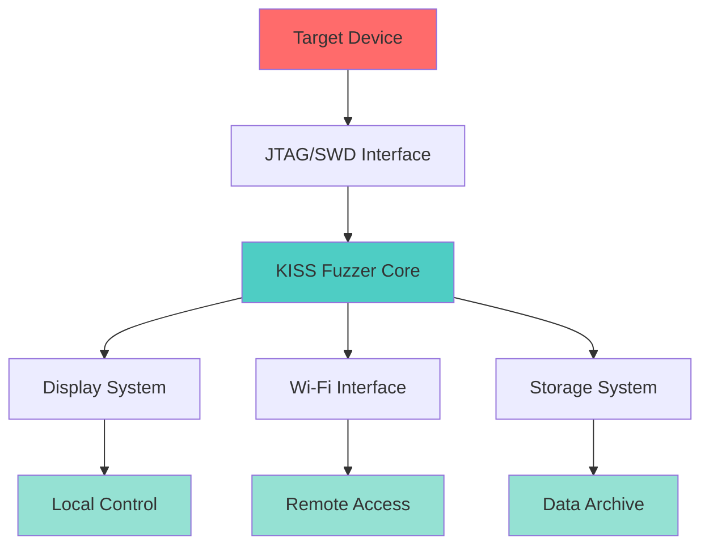

# KISS Fuzzer Documentation

```{note}
**Quick Navigation:** Jump to [Getting Started](getting-started.md) | [Hardware](hardware.md) | [Software](software.md) | [API Reference](api-reference.md) | [Tutorials](tutorials.md) | [Development](development.md) | [Troubleshooting](troubleshooting.md)
```

KISS Fuzzer is a compact, handheld JTAG/SWD fuzzing and exploitation tool designed for embedded security research and hardware analysis.

```{toctree}
:maxdepth: 2
:caption: Documentation
:includehidden:

getting-started
hardware
software
api-reference
tutorials
development
troubleshooting
```

## Overview

KISS Fuzzer (Keep It Simple, Silly) provides a portable solution for JTAG and SWD interface analysis. The device combines hardware accessibility with advanced features, making it suitable for both beginners and experienced security researchers.

### Key Features

**Display System** - 240×64 OLED banner display provides real-time status and scan results with clear visibility.

**User Interface** - 5-way joystick navigation offers intuitive menu control without complex key combinations.

**Power Management** - Integrated Li-ion battery with USB-C charging enables extended field use.

**JTAG/SWD Interface** - High-speed interface supports up to 10 MHz operation with multiple protocol compatibility.

**Remote Access** - Built-in Wi-Fi enables web-based control and monitoring for automated testing scenarios.

**Data Logging** - MicroSD card storage provides comprehensive logging and result archival capabilities.

**Voltage Compatibility** - Configurable voltage levels support targets from 1.8V to 5V with automatic level shifting.

## System Architecture

The KISS Fuzzer architecture consists of integrated hardware and software components designed for reliability and extensibility:



The system processes JTAG/SWD communications through dedicated PIO hardware, displays real-time status information, and maintains comprehensive logs of all operations.

## Getting Started

New users should begin with the [Getting Started Guide](getting-started.md) which covers initial setup, basic connections, and first scans.

For detailed technical specifications, refer to the [Hardware Guide](hardware.md).

For troubleshooting common issues, consult the [Troubleshooting Section](troubleshooting.md).
    B --> H
    C --> H
    D --> H
```

## Getting Help

- **GitHub Issues**: Report bugs and request features
- **Documentation**: Comprehensive guides and API reference
- **Community**: Join our Discord for real-time support

```{admonition} Safety Notice
:class: warning

KISS Fuzzer is designed for authorized security testing and educational purposes only. 
Always ensure you have permission to test target devices and comply with local laws.
```
