# Software Architecture

```{note}
**Navigation:** [Home](index.md) | [Getting Started](getting-started.md) | [Hardware](hardware.md) | [API Reference](api-reference.md) | [Tutorials](tutorials.md) | [Development](development.md) | [Troubleshooting](troubleshooting.md)
```

This section provides detailed information about the KISS Fuzzer software architecture, implementation, and development practices.

## System Overview

The KISS Fuzzer software architecture implements a multi-layered design that ensures reliable operation and maintainable code structure:


**Design Philosophy**: Each layer handles specific responsibilities. The JTAG engine operates independently of Wi-Fi, the display system doesn't manage battery levels, and the web server doesn't need JTAG protocol knowledge. This separation ensures reliability and simplifies debugging.

## Core Components

### Display Driver

The ultra-wide OLED display system provides real-time status information with optimized performance:

- **Smooth Operation**: Background updates prevent flicker and lag
- **Power Efficiency**: Display only updates when content changes
- **Clear Rendering**: Custom font rendering ensures readability on the narrow display

**Technical Implementation**: Double buffering renders content to memory before display transfer, eliminating visual artifacts and ensuring smooth updates.

### UI System

The user interface manages complexity through intuitive design:

- **Intuitive Navigation**: Joystick controls follow standard conventions - up/down for scrolling, left for back navigation, right/OK for selection
- **Context Awareness**: The interface displays relevant information based on current operation
- **Responsive Feedback**: Immediate visual confirmation for all user interactions

### JTAG Engine (`jtag.c/h`)

Core protocol implementation using PIO:

- **Protocols**: JTAG (IEEE 1149.1) and SWD
- **Speed**: Up to 10 MHz using dedicated PIO state machines
- **Features**: Device scanning, boundary scan, memory operations

### Advanced Fuzzing Engine (`jtag_fuzzer.c/h`, `fuzz_commands.c/h`)

**New in v0.9.0**: Sophisticated fuzzing capabilities with interactive UI integration:

- **Strategies**: Sequential, Random, Dictionary, Genetic, Smart fuzzing
- **Operations**: IDCODE scan, IR/DR fuzzing, boundary scan, memory probe
- **Automation**: Pin discovery with confidence ratings
- **Real-time**: Progress monitoring, anomaly detection, statistics
- **Interface**: Command-line integration with predefined operations
- **Logging**: Comprehensive session tracking and result storage

**UI Integration Features**:
- Dedicated fuzzing menu accessible from main interface
- Interactive command selection with joystick navigation
- Real-time status display and progress feedback
- Seamless integration with FreeRTOS task architecture

See [Fuzzing UI Integration](fuzzing-ui-integration.md) for complete details.

### Wi-Fi Server (`wifi.c/h`)

Web interface and remote control:

- **Mode**: Access Point with captive portal
- **Protocol**: HTTP server with REST API
- **Features**: Real-time status, file transfer, remote control

### Power Management (`power.c/h`)

Battery monitoring and power optimization:

- **Monitoring**: Voltage, current, and charge status
- **Protection**: Over-discharge and thermal protection
- **Optimization**: Dynamic frequency scaling and sleep modes

### Storage Manager (`storage.c/h`)

MicroSD card operations:

- **Filesystem**: FAT32 with wear leveling
- **Logging**: Structured log files with rotation
- **Data**: Scan results, memory dumps, configuration

## Task Architecture

### Task Priorities

| Task | Priority | Stack Size | Description |
|------|----------|------------|-------------|
| **System** | Highest (4) | 4KB | Critical system monitoring |
| **Wi-Fi** | High (3) | 8KB | Network communication |
| **JTAG** | Medium (2) | 6KB | Protocol operations |
| **UI** | Medium (2) | 4KB | User interface |
| **Power** | Low (1) | 2KB | Background monitoring |

### Inter-Task Communication


## Memory Management

### Heap Configuration

- **Total Heap**: 128KB FreeRTOS heap
- **Allocation**: heap_4 algorithm with coalescence
- **Protection**: Stack overflow detection enabled
- **Monitoring**: Runtime heap usage tracking

### Buffer Management

- **Display Buffer**: 2KB frame buffer for OLED
- **JTAG Buffer**: 4KB for protocol data
- **Wi-Fi Buffer**: 8KB for HTTP requests/responses
- **SD Buffer**: 2KB for filesystem operations

## Error Handling

### Exception Handling

```c
// Example error handling pattern
typedef enum {
    KISS_OK = 0,
    KISS_ERROR_INVALID_PARAM,
    KISS_ERROR_HARDWARE_FAULT,
    KISS_ERROR_TIMEOUT,
    KISS_ERROR_NO_MEMORY
} kiss_error_t;

kiss_error_t operation_with_error_handling(void) {
    if (!validate_parameters()) {
        return KISS_ERROR_INVALID_PARAM;
    }
    
    if (!hardware_ready()) {
        return KISS_ERROR_HARDWARE_FAULT;
    }
    
    // Perform operation...
    return KISS_OK;
}
```

### Logging System

- **Levels**: DEBUG, INFO, WARN, ERROR, FATAL
- **Destinations**: UART, SD card, Wi-Fi
- **Format**: Structured logging with timestamps
- **Rotation**: Automatic log file rotation

## Configuration Management

### Compile-Time Configuration

Settings defined in header files:

```c
// kiss_fuzzer.h
#define JTAG_MAX_FREQUENCY_HZ    10000000
#define WIFI_SSID                "KISS-Fuzzer"
#define BATTERY_LOW_THRESHOLD    15
#define LOG_LEVEL                LOG_INFO
```

### Runtime Configuration

User-configurable settings stored on SD card:

- **Target Voltage**: 1.8V, 3.3V, 5V options
- **JTAG Speed**: Variable from 1 kHz to 10 MHz
- **Wi-Fi Settings**: SSID, password, channel
- **Display**: Brightness, timeout, orientation

## Security Considerations

### Input Validation

- **Bounds Checking**: All user inputs validated
- **Sanitization**: Web interface input sanitization
- **Rate Limiting**: Protection against abuse

### Memory Safety

- **Stack Protection**: Canary values on critical stacks
- **Buffer Overflow**: Compile-time and runtime checks
- **Integer Overflow**: Safe arithmetic operations

## Performance Optimization

### Critical Paths

- **JTAG Timing**: PIO ensures deterministic timing
- **Display Updates**: Frame rate limiting for efficiency
- **Wi-Fi Response**: Asynchronous request handling

### Power Optimization

- **CPU Scaling**: Dynamic frequency adjustment
- **Peripheral Control**: Selective peripheral shutdown
- **Sleep Modes**: Aggressive sleep when idle

## Detailed System Architecture

### Power Management & Glitch Injection Architecture


### Hardware Block Diagram

```mermaid
flowchart TB
    subgraph "User Interface Layer"
        direction LR
        J1[5-Way Joystick<br/>Navigation] 
        USB[USB-C Port<br/>Power/Data]
        WIFI[Wi-Fi Module<br/>📶 802.11n]
    end
    
    subgraph "Processing Core"
        direction TB
        MCU[RP2040 MCU<br/>🧠 Dual ARM Cortex-M0+<br/>133MHz • 264KB SRAM]
        PIO[PIO Engine<br/>8 State Machines<br/>High-Speed Protocol I/O]
        GPIO[GPIO Controller<br/>26 Configurable Pins<br/>3.3V Logic Level]
    end
    
    subgraph "Output & Debug"
        direction LR
        OLED[240×64 OLED<br/>Banner Display<br/>Real-time Status]
        JTAG[JTAG/SWD Port<br/>Debug Interface<br/>10MHz Max Speed]
        SD[MicroSD Card<br/>Data Logging<br/>Scan Results]
    end
    
    subgraph "Power Management"
        direction TB
        BATT[Li-ion Battery<br/>🔋 3.7V 2000mAh<br/>USB-C Charging]
        PMGMT[Power Controller<br/>LDO Regulators<br/>Voltage Monitoring]
        TPWR[Target Power<br/>1.8V - 5V Output<br/>Selectable Levels]
    end
    
    subgraph "Protection & Control"
        direction LR
        PROTECT[Protection Circuit<br/>Over-voltage<br/>Reverse Polarity]
        GLITCH[Glitch Generator<br/>MOSFET Switch<br/>Fault Injection]
        LEDS[Status LEDs<br/>Power/Activity<br/>Error Indication]
    end
    
    %% Connections
    J1 --> MCU
    USB --> BATT
    WIFI --> MCU
    
    MCU --> PIO
    MCU --> GPIO
    
    MCU --> OLED
    PIO --> JTAG
    GPIO --> SD
    
    BATT --> PMGMT
    PMGMT --> MCU
    PMGMT --> TPWR
    
    GPIO --> PROTECT
    GPIO --> GLITCH
    GPIO --> LEDS
    
    PROTECT --> JTAG
    GLITCH --> TPWR
    
    %% Styling
    classDef userInterface fill:#e3f2fd,stroke:#1976d2,stroke-width:2px,color:#000
    classDef processing fill:#e8f5e8,stroke:#388e3c,stroke-width:2px,color:#000
    classDef output fill:#fff3e0,stroke:#f57c00,stroke-width:2px,color:#000
    classDef power fill:#fce4ec,stroke:#c2185b,stroke-width:2px,color:#000
    classDef protection fill:#f3e5f5,stroke:#7b1fa2,stroke-width:2px,color:#000
    
    class J1,USB,WIFI userInterface
    class MCU,PIO,GPIO processing
    class OLED,JTAG,SD output
    class BATT,PMGMT,TPWR power
    class PROTECT,GLITCH,LEDS protection
```



### Software Architecture Flow


### JTAG/SWD Operation Flow

```mermaid
flowchart TD
    Start([Start Power On<br/>System Boot]) --> Init[Initialize Hardware<br/>GPIO • SPI • PIO • Wi-Fi]
    Init --> SelfTest[Self Test<br/>Display • SD Card • Battery]
    SelfTest --> Menu{Main Menu<br/>Select Operation}
    
    Menu -->|1| AutoScan[Auto JTAG Scan<br/>Smart Detection]
    Menu -->|2| Manual[Manual Mode<br/>Expert Operations]
    Menu -->|3| Glitch[Power Glitch<br/>Fault Injection]
    Menu -->|4| Network[Network Operations<br/>Wi-Fi & Web UI]
    Menu -->|5| Settings[Configuration<br/>System Settings]
    
    %% Auto Scan Flow
    AutoScan --> CheckTarget[Check Target<br/>Power & Connectivity]
    CheckTarget --> PinDetect[Detect JTAG Pins<br/>TCK • TMS • TDI • TDO]
    PinDetect --> ValidateChain[Validate Chain<br/>TAP Response Test]
    ValidateChain --> ScanDevices[Scan JTAG Chain<br/>Read Device IDCODEs]
    ScanDevices --> ChainAnalysis[Chain Analysis<br/>Device Count & Types]
    ChainAnalysis --> DisplayResults[Show Results<br/>OLED Display]
    
    %% Manual Mode Flow
    Manual --> SelectOp{Select Operation<br/>Choose Command Type}
    SelectOp -->|Mem| MemDump[Memory Dump<br/>Read Flash/RAM]
    SelectOp -->|Scan| BoundaryScan[Boundary Scan<br/>IEEE 1149.1 Test]
    SelectOp -->|Cmd| CustomCmd[Custom Commands<br/>Direct JTAG Access]
    SelectOp -->|Write| MemWrite[Memory Write<br/>Program Flash]
    
    %% Glitch Attack Flow
    Glitch --> GlitchSetup[Setup Parameters<br/>Timing • Voltage • Count]
    GlitchSetup --> GlitchArm[Arm Trigger<br/>Wait for Target State]
    GlitchArm --> GlitchFire[Execute Glitch<br/>MOSFET Pulse]
    GlitchFire --> GlitchAnalyze[Analyze Response<br/>Success Detection]
    GlitchAnalyze --> GlitchRepeat{Repeat Attack?<br/>Continue Campaign}
    GlitchRepeat -->|Yes| GlitchArm
    GlitchRepeat -->|No| DisplayResults
    
    %% Network Operations
    Network --> WebStart[Start Web Server<br/>HTTP on Port 80]
    WebStart --> WebInterface[Web Interface<br/>Remote Control]
    WebInterface --> WebLogs[Live Logs<br/>Real-time Status]
    
    %% Common Flow
    DisplayResults --> LogSD[Save to SD Card<br/>Timestamped Results]
    MemDump --> LogSD
    BoundaryScan --> LogSD
    CustomCmd --> LogSD
    MemWrite --> LogSD
    GlitchAnalyze --> LogSD
    WebLogs --> LogSD
    
    LogSD --> WebUpdate[Update Web Interface<br/>Refresh Dashboard]
    WebUpdate --> BattCheck[Battery Check<br/>Power Management]
    BattCheck --> BackToMenu{Return to Menu?<br/>Continue Operation}
    BackToMenu -->|Yes| Menu
    BackToMenu -->|No| Shutdown[System Shutdown<br/>Safe Power Down]
    
    Settings --> ConfigNetwork[Wi-Fi Settings<br/>SSID • Password]
    Settings --> ConfigTarget[Target Config<br/>Voltage • Speed]
    Settings --> ConfigSystem[System Config<br/>Display • Logging]
    ConfigNetwork --> Menu
    ConfigTarget --> Menu
    ConfigSystem --> Menu
    
    %% Error Handling
    PinDetect -->|Failed| ErrorHandler[Error Handler<br/>Display Issue]
    ValidateChain -->|Failed| ErrorHandler
    ScanDevices -->|Failed| ErrorHandler
    ErrorHandler --> Menu
    
    %% Styling
    classDef startEnd fill:#c8e6c9,stroke:#81c784,stroke-width:2px,color:#000
    classDef menu fill:#bbdefb,stroke:#90caf9,stroke-width:2px,color:#000
    classDef operation fill:#ffe0b2,stroke:#ffcc02,stroke-width:2px,color:#000
    classDef storage fill:#e1bee7,stroke:#ce93d8,stroke-width:2px,color:#000
    classDef network fill:#b2ebf2,stroke:#80deea,stroke-width:2px,color:#000
    classDef error fill:#ffcdd2,stroke:#f8bbd9,stroke-width:2px,color:#000
    classDef glitch fill:#f8bbd9,stroke:#f48fb1,stroke-width:2px,color:#000
    
    class Start,Shutdown startEnd
    class Menu,BackToMenu menu
    class AutoScan,Manual,PinDetect,ScanDevices,MemDump,BoundaryScan,CustomCmd,MemWrite operation
    class LogSD,WebUpdate,DisplayResults storage
    class Network,WebStart,WebInterface,WebLogs,ConfigNetwork network
    class ErrorHandler error
    class Glitch,GlitchSetup,GlitchArm,GlitchFire,GlitchAnalyze,GlitchRepeat glitch
```



### FreeRTOS Task Architecture & Communication


